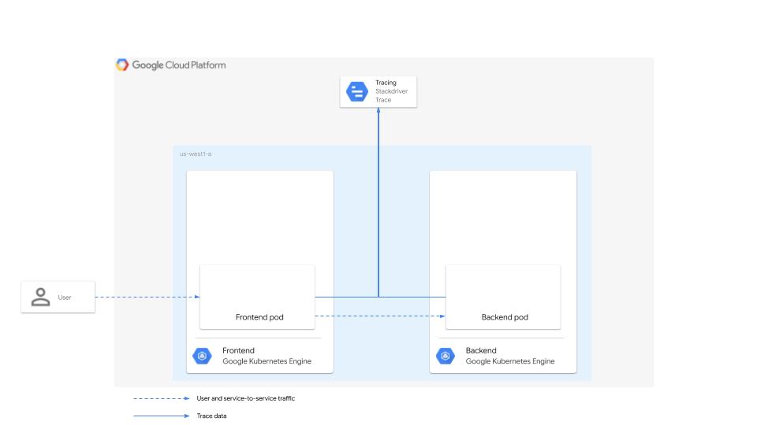
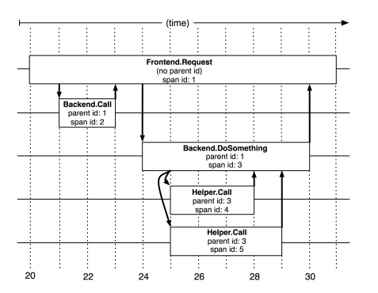

Toward the end of last year, I had the good fortune of publishing a reference [guide](https://cloud.google.com/solutions/using-distributed-tracing-to-observe-microservice-latency-with-opencensus-and-stackdriver-trace) on using OpenCensus for distributed tracing.  In it, I covered distributed tracing fundamentals, like traces, spans, and context propagation, and demonstrated using OpenCensus to instrument a simple pair of frontend/backend services written in Go.  Since then, the OpenCensus and OpenTracing projects have merged into [OpenTelemetry](https://opentelemetry.io), a "single set of APIs, libraries, agents, and collector services to capture distributed traces and metrics from your application."  I wanted to attempt to reproduce the work I did in OpenCensus using the new project and see how much has changed.

# Outline - delete
* Intro - refer to published guide
* Describe concepts
  * traces
  * Spans
  * Context and propagation?
* Describe app - simple frontend/backend with backend making external call
* Show code
* Show traces

# Objective
For this exercise, I built a simple [demo](https://github.com/yuriatgoogle/stack-doctor/opentelemetry-tracing-demo).  It consists of two services. The frontend service receives an incoming request and makes a request to the backend.  The backend receives the request and returns a response.  Our objective is to trace this interaction to determine the overall response latency and understand how the two services and the nework connectivity between them contribute to the overall latency.



In the original guide, the two services were deployed in two separate GKE clusters, but that is actually not necessary to demonstrate distributed tracing.  For this exercise, we'll simply run both services locally.

# Primitives
While the basic concepts are covered in the reference guide and in much greater detail in the Google Dapper research [paper](https://research.google.com/archive/papers/dapper-2010-1.pdf), it's still worth briefly covering them here such that we can then understand how they're implemented in the code.  

From the reference guide:

>A _trace_ is the total of information that describes how a distributed system responds to a user request. Traces are composed of _spans_, where each span represents a specific request and response pair involved in serving the user request. The _parent_ span describes the latency as observed by the end user. Each of the _child_ spans describes how a particular service in the distributed system was called and responded to, with latency information captured for each.

This is well illustrated in the aforementioned research paper using this diagram:



# Implementation
Let's take a look at how we can implement distributed tracing in our frontend/backend service pair using OpenTelemetry. Note that most of this is adopted from the [samples](https://github.com/open-telemetry/opentelemetry-go/tree/master/example) published by OpenTelemetry in their Github [repo](https://github.com/open-telemetry/opentelemetry-go). I made relatively minor changes to add custom spans and use the Mux router, rather than just basic HTTP handling. 

## Frontend code
We'll start by reviewing the frontend [code](https://github.com/yuriatgoogle/stack-doctor/blob/master/opentelemetry-tracing-demo/go/frontend/frontend.go).  First, the imports:

```go
import (
	"fmt"
	"log"
	"net/http"
	"os"
	"context"
	"io/ioutil"
	"google.golang.org/grpc/codes"

	"github.com/gorilla/mux"

	"go.opentelemetry.io/otel/api/distributedcontext"
	"go.opentelemetry.io/otel/api/global"
	"go.opentelemetry.io/otel/api/trace"
	"go.opentelemetry.io/otel/exporter/trace/stackdriver"
	"go.opentelemetry.io/otel/plugin/httptrace"
	sdktrace "go.opentelemetry.io/otel/sdk/trace"
)
```
Mostly, we're using a variety of Open